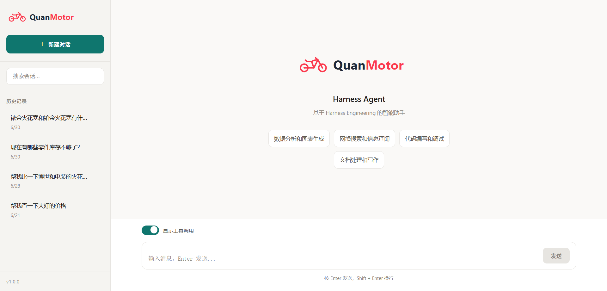
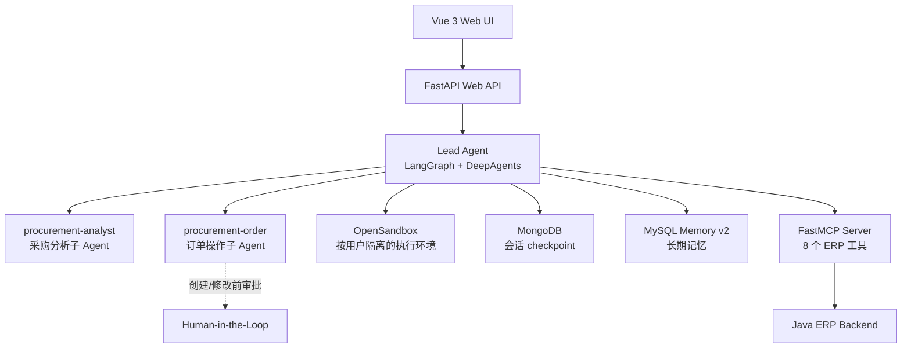

# Harness Agent

> 面向企业 ERP 采购场景的 Agent 应用：将采购分析与订单操作拆分为专职子 Agent，通过 MCP 访问业务系统，并用沙箱、审批与状态持久化控制执行风险。

| 项目定位 | 企业采购 Agent 应用 / Harness Engineering 实践 |
| --- | --- |
| 核心场景 | 供应商与零部件分析、库存预警、采购订单创建与修改 |
| 工程重点 | 多 Agent 协作、MCP 工具集成、Sandbox 隔离、记忆与恢复、Human-in-the-Loop |
| 技术路线 | LangGraph · DeepAgents · FastMCP · OpenSandbox · FastAPI · Vue 3 |

## 业务场景

- **采购分析**：查询供应商、零部件、订单明细与库存预警，结合网页搜索和图表生成形成采购分析结论。
- **订单操作**：创建或修改采购订单时，先补齐必要字段并进行 Schema 校验，再进入人工审批。
- **跨会话协作**：为后续对话注入可控的长期记忆，同时保留可恢复的会话 checkpoint。

## 界面预览



## 系统架构



## 核心工程设计

### 1. 面向任务的多 Agent 分工

- `procurement-analyst` 负责供应商比价、库存预警、采购分析与报告生成。
- `procurement-order` 负责订单创建、修改、字段补全与执行确认。
- 两个子 Agent 由 YAML 定义职责、工具、技能和中断策略，减少业务能力与主流程的耦合。

### 2. MCP 连接业务系统

- 使用 FastMCP 将 Java ERP REST API 封装为 **8 个工具**，覆盖供应商、零部件、订单和库存四类业务能力。
- Agent 通过工具描述发现能力；ERP 访问逻辑保留在 MCP 服务层，而非散落在 Prompt 中。

### 3. 受控执行与故障处理

- OpenSandbox 按用户维护独立的执行环境，并支持预热、健康检查与重建。
- 沙箱异常通过熔断与调用上限限制继续扩散。
- 对 `order_create` 和 `order_update` 设置 Human-in-the-Loop 审批，避免模型直接执行写操作。

### 4. 上下文与状态管理

- MongoDB 保存 Agent checkpoint，支持会话恢复与中断状态持久化。
- Memory v2 通过 MySQL 和功能开关管理长期记忆读取、写入、后台任务与语义检索。
- 长工具输出交给文件系统和摘要机制处理，降低长任务的上下文噪声。

## 可验证代码入口

| 想了解什么 | 代码入口 |
| --- | --- |
| 主 Agent、工具池和中间件链 | [src/agent/main_agent.py](src/agent/main_agent.py) |
| 采购分析子 Agent 的职责与工具 | [procurement_analyst.yaml](src/agent/subagents/configs/procurement_analyst.yaml) |
| 订单审批与字段补全流程 | [procurement_order.yaml](src/agent/subagents/configs/procurement_order.yaml) |
| 按用户隔离的 Sandbox 生命周期 | [sandbox_manager.py](src/agent/backends/sandbox_manager.py) |
| ERP MCP 服务与工具注册 | [server_main.py](src/mcp_server/server_main.py) |
| 自动化测试覆盖 | [src/test](src/test) |

## 技术栈

- **Agent 框架**: LangGraph、DeepAgents
- **后端服务**: Python、FastAPI
- **工具协议**: FastMCP
- **模型服务**: DeepSeek
- **沙箱执行**: OpenSandbox
- **数据存储**: MySQL、MongoDB
- **前端**: Vue 3、Vite

<details>
<summary>项目结构</summary>

```text
Harness-Agent/
├── alembic/                 # 数据库迁移
├── docs/                    # 项目文档与界面资源
├── frontend/                # Vue 3 前端
│   └── src/                 # 页面、组件与 API 客户端
├── src/
│   ├── agent/               # Agent 核心
│   │   ├── backends/        # OpenSandbox 后端管理
│   │   ├── memory/          # 长期记忆与任务处理
│   │   ├── middlewares/     # 召回、沙箱、工具等中间件
│   │   ├── subagents/       # 子 Agent 与 YAML 配置
│   │   ├── tools/           # MCP 工具客户端
│   │   └── main_agent.py    # 主 Agent 入口
│   ├── api_view/            # FastAPI Web API
│   ├── mcp_server/          # MCP Server 与 ERP 工具封装
│   ├── skills/              # Agent Skills
│   └── test/                # 自动化测试
├── .env.example             # 环境变量示例
├── alembic.ini              # Alembic 配置
├── langgraph.json           # LangGraph 配置
├── pyproject.toml           # Python 项目配置
├── requirements.txt         # Python 依赖
└── start_web.py             # Web 应用启动入口
```

</details>
